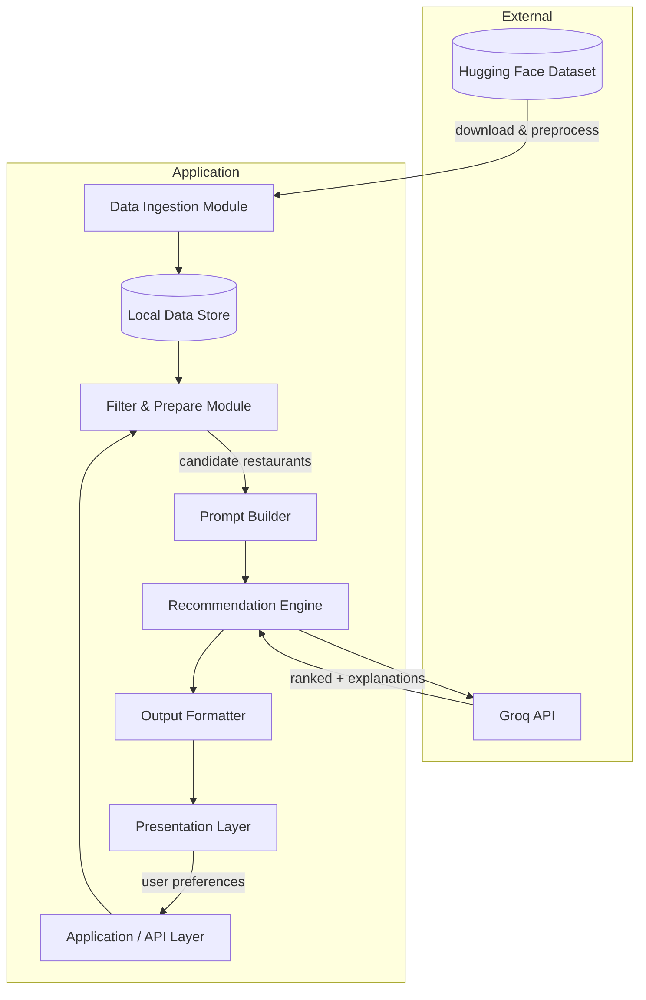
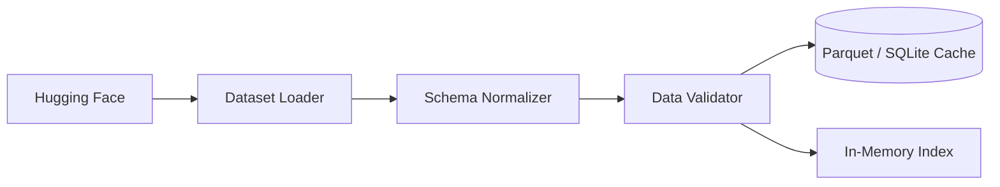
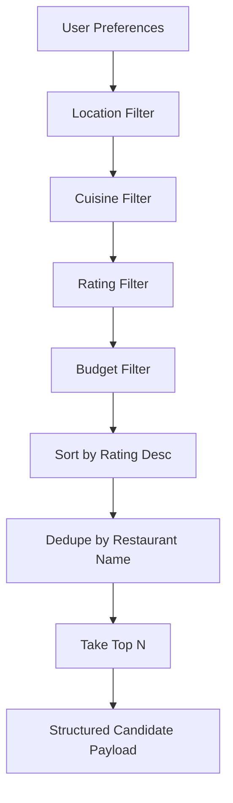
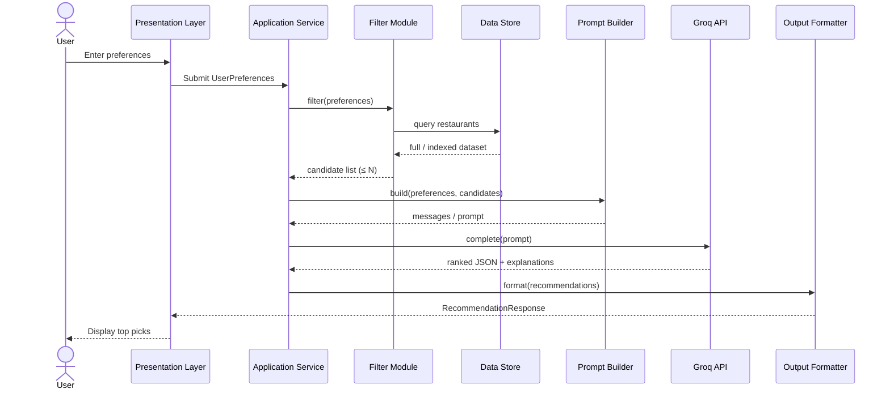
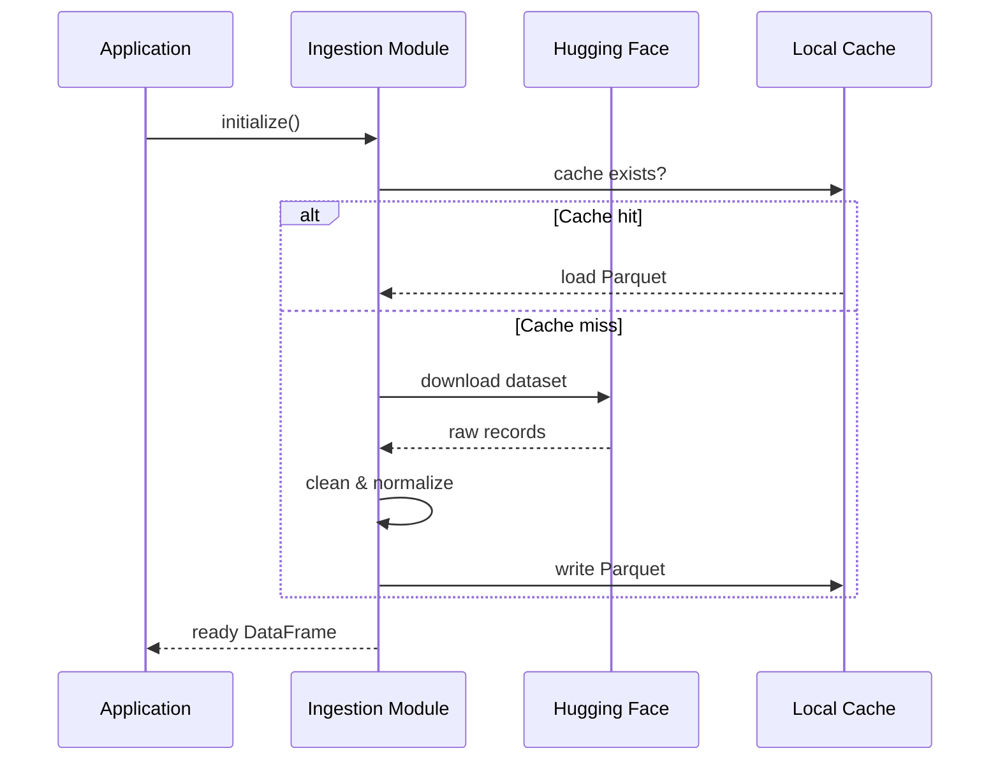
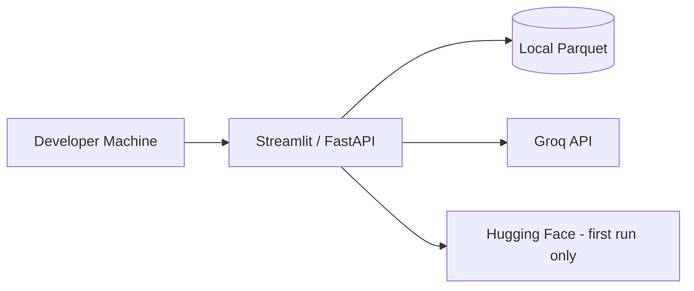
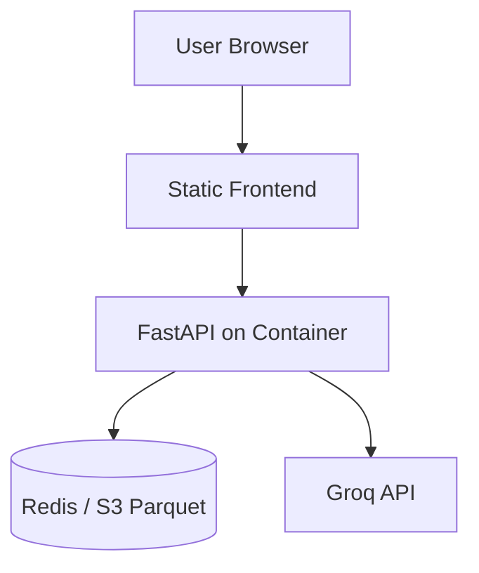

# Architecture: AI-Powered Restaurant Recommendation System

This document defines the technical architecture for the Zomato-inspired restaurant recommendation service, derived from [`context.md`](context.md) and [`doc/problemStatement.txt`](doc/problemStatement.txt).

---

## Table of Contents

1. [Design Goals](#1-design-goals)
2. [High-Level Architecture](#2-high-level-architecture)
3. [Component Architecture](#3-component-architecture)
4. [Data Architecture](#4-data-architecture)
5. [Application Layers](#5-application-layers)
6. [Request & Data Flow](#6-request--data-flow)
7. [LLM Integration Architecture](#7-llm-integration-architecture)
8. [API & Interface Design](#8-api--interface-design)
9. [Recommended Technology Stack](#9-recommended-technology-stack)
10. [Project Structure](#10-project-structure)
11. [Deployment Architecture](#11-deployment-architecture)
12. [Cross-Cutting Concerns](#12-cross-cutting-concerns)
13. [Future Extensions](#13-future-extensions)

---

## 1. Design Goals

| Goal | Description |
|------|-------------|
| **Accuracy** | Recommendations grounded in real dataset fields, not hallucinated venues |
| **Personalization** | LLM ranks and explains choices using user preferences |
| **Transparency** | Every recommendation includes a human-readable “why” |
| **Separation of concerns** | Structured filtering before LLM; LLM for reasoning, not data retrieval |
| **Maintainability** | Clear boundaries between ingestion, filtering, AI, and presentation |
| **Cost control** | Send only a filtered subset of restaurants to the LLM (token limits) |

### Architectural Principles

1. **Filter first, reason second** — Narrow candidates with deterministic rules; use the LLM only on a bounded candidate set.
2. **Structured in, structured out** — LLM responses parsed into typed objects (JSON) for reliable UI rendering.
3. **Single source of truth** — Hugging Face dataset is authoritative; cache locally after first load.
4. **Fail gracefully** — If LLM fails, fall back to rule-based ranking from filtered data.

---

## 2. High-Level Architecture

The system follows a **pipeline architecture** with five logical stages aligned to the workflow in `context.md`.



### Logical Tiers

| Tier | Responsibility |
|------|----------------|
| **Presentation** | Collect preferences, display recommendations |
| **Application** | Orchestrate workflow, validate input, handle errors |
| **Domain** | Filtering rules, budget mapping, preference matching |
| **AI** | Prompt construction, LLM calls, response parsing |
| **Data** | Load, clean, cache, and query restaurant records |

---

## 3. Component Architecture

### 3.1 Data Ingestion Module

**Purpose:** Load the Zomato dataset from Hugging Face, normalize schema, and persist for fast repeated access.

| Responsibility | Details |
|----------------|---------|
| **Source** | `ManikaSaini/zomato-restaurant-recommendation` (~51.7K rows, ~574 MB) |
| **Load** | `datasets` library or direct Parquet/CSV download |
| **Extract** | name, location (city/area), cuisine, cost, rating, and any available metadata |
| **Clean** | Handle nulls, normalize cuisine strings, parse cost to numeric ranges, standardize city names |
| **Output** | In-memory DataFrame and/or cached Parquet/SQLite for startup performance |



**Key decisions:**

- Run ingestion **once at startup** (or via CLI `ingest` command), not on every user request.
- Log row counts and null rates after preprocessing for observability.

---

### 3.2 User Input Module (Presentation)

**Purpose:** Capture and validate user preferences before recommendation.

| Field | Type | Validation |
|-------|------|------------|
| `location` | string (enum or free text) | Must match known cities in dataset |
| `budget` | enum: `low` \| `medium` \| `high` | Required |
| `cuisine` | string or multi-select | Optional; fuzzy match supported |
| `min_rating` | float (0–5) | Optional; default 0 |
| `additional_preferences` | string (free text) | Optional; passed to LLM for soft matching |

**UI options (choose one for implementation):**

- **Streamlit** — Fastest path for demos and coursework
- **Gradio** — Similar; good for ML-focused UIs
- **Web app (React + FastAPI)** — Production-style separation

---

### 3.3 Filter & Prepare Module (Integration Layer)

**Purpose:** Deterministically reduce the full dataset to a **candidate set** the LLM can reason over.

| Step | Logic |
|------|-------|
| 1. Location filter | `city == user.location` (case-insensitive) |
| 2. Cuisine filter | Substring or token match on cuisine field |
| 3. Rating filter | `rating >= min_rating` |
| 4. Budget filter | Map `low/medium/high` to cost thresholds (config-driven percentiles or fixed ranges) |
| 5. Sort | Order by rating (desc), then votes, then name |
| 6. **Deduplicate by name** | One row per restaurant name (case-insensitive); keep highest-rated row |
| 7. Cap results | Limit to top N (e.g., 20–50) to control token usage |
| 8. Serialize | Convert rows to compact JSON/list for prompt injection |



**Budget mapping example (configurable):**

| Budget | Cost range (illustrative) |
|--------|---------------------------|
| low | ≤ 500 (INR for two) |
| medium | 501 – 1500 |
| high | > 1500 |

Actual thresholds should be derived from dataset percentiles during ingestion.

---

### 3.4 Recommendation Engine (LLM)

**Purpose:** Rank candidates, generate explanations, and optionally summarize the result set.

| Sub-component | Role |
|---------------|------|
| **Prompt Builder** | Assembles system + user messages with preferences and candidate JSON |
| **LLM Client** | Abstracts provider (**Groq** primary; optional Ollama for local dev) |
| **Response Parser** | Validates JSON schema; maps to `Recommendation` objects; **dedupes by restaurant name** |
| **Fallback Ranker** | Rule-based sort if LLM unavailable; **dedupes by name** before top-K |
| **Dedupe utility** | `src/domain/dedupe.py` — shared name normalization used by filter, parser, fallback, and service |

**LLM responsibilities (from context):**

- Rank restaurants relative to user preferences
- Explain why each fits
- Optionally provide a short summary of overall choices

**Non-LLM responsibilities (stay in Filter module):**

- Hard filters (location, min rating, budget band)
- Dataset integrity and field extraction

**Duplicate restaurant names (data + LLM):**

The Hugging Face dataset can contain multiple rows with the **same restaurant name** but different `id` values. The LLM may also return the same venue twice with different ranks. To prevent repeated names on the results page:

| Layer | Behavior |
|-------|----------|
| **Filter** | After sort, `drop_duplicates` on normalized `name`; keep first (best rating) |
| **Prompt** | System rule: each restaurant name at most once in output |
| **Parser** | After join by `restaurant_id`, dedupe by normalized name; re-number ranks |
| **Fallback** | Dedupe sorted candidates by name before taking top-K |
| **RecommendationService** | Final `dedupe_recommendations_by_name()` after enrichment |

Acceptance: for any `top_k`, all `recommendation.name` values in the response are unique (case-insensitive).

---

### 3.5 Output Display Module

**Purpose:** Render top-K recommendations in a consistent, user-friendly format with **accessible contrast** on result cards.

**Per-recommendation display contract:**

| Field | Source | UI requirement |
|-------|--------|----------------|
| **Restaurant Name** | Dataset (always backfilled from `restaurant_id`) | **Required** — prominent heading, dark text on light card |
| **Address** | `raw_metadata.address` or `location_detail` + `city` | **Required** — full line below name, readable gray (`#374151`) |
| Cuisine | Dataset | Meta row |
| Rating | Dataset | Meta row with stars |
| Estimated Cost | Dataset | Meta row |
| AI-generated explanation | LLM output | Separated section with border-top |
| Rank | LLM output (1 = best) | Badge (#1, #2, …) |

**Accessibility & readability (Streamlit dark theme):**

- Result cards use a **light background** (`#ffffff`) with **explicit text colors** — never inherit Streamlit theme heading colors (which are light-on-dark and invisible on white cards).
- Target contrast: name `#1a1a2e` on white (~15:1), address `#374151` on white (~7:1), body `#1f2937` on white (~12:1) — meets WCAG AA.
- Use `<div class="rec-name">` instead of `<h3>` to avoid global theme overrides.
- HTML-escape all dynamic fields via `html.escape()` before `unsafe_allow_html`.

**Address enrichment:** `ResponseParser` and `FallbackRanker` populate `address` via `format_restaurant_address()` in `src/domain/display.py` when building each `Recommendation`.

Optional UI enhancements: badges for budget fit, star rating visualization, “why this matches” highlight for `additional_preferences`.

---

## 4. Data Architecture

### 4.1 Source Dataset

| Attribute | Value |
|-----------|-------|
| Provider | Hugging Face |
| Dataset ID | `ManikaSaini/zomato-restaurant-recommendation` |
| Scale | ~51,717 restaurants |
| Size | ~574 MB |

### 4.2 Canonical Restaurant Schema (Target)

After ingestion, normalize to an internal schema regardless of raw column names:

```json
{
  "id": "string",
  "name": "string",
  "city": "string",
  "location_detail": "string | null",
  "cuisines": ["string"],
  "rating": "float",
  "cost_for_two": "number | null",
  "budget_tier": "low | medium | high",
  "votes": "integer | null",
  "raw_metadata": "object"
}
```

### 4.3 User Preferences Schema

```json
{
  "location": "string",
  "budget": "low | medium | high",
  "cuisine": "string | null",
  "min_rating": "float",
  "additional_preferences": "string | null"
}
```

### 4.4 Recommendation Output Schema

```json
{
  "summary": "string | null",
  "recommendations": [
    {
      "rank": 1,
      "restaurant_id": "string",
      "name": "string",
      "cuisine": "string",
      "rating": 4.5,
      "estimated_cost": "string",
      "explanation": "string",
      "location_detail": "string | null",
      "address": "string"
    }
  ]
}
```

### 4.5 Storage Strategy

| Layer | Technology | Use case |
|-------|------------|----------|
| **Raw cache** | Parquet file | Fast reload after first download |
| **Runtime** | Pandas / Polars DataFrame | Filtering and sorting |
| **Optional** | SQLite | Indexed queries by city + cuisine |

No user data is persisted unless explicitly required for history features (out of initial scope).

---

## 5. Application Layers

```
┌─────────────────────────────────────────────────────────────┐
│                    PRESENTATION LAYER                        │
│  Streamlit / Gradio / Web UI — forms, results, loading states│
└─────────────────────────────┬───────────────────────────────┘
                              │
┌─────────────────────────────▼───────────────────────────────┐
│                    APPLICATION LAYER                         │
│  RecommendationService — orchestrates end-to-end flow          │
│  Input validation, error handling, session/config              │
└─────────────────────────────┬───────────────────────────────┘
                              │
        ┌─────────────────────┼─────────────────────┐
        ▼                     ▼                     ▼
┌───────────────┐   ┌─────────────────┐   ┌─────────────────┐
│  DOMAIN       │   │  AI LAYER       │   │  DATA LAYER     │
│  FilterService│   │  PromptBuilder  │   │  DataLoader     │
│  BudgetMapper │   │  LLMClient      │   │  RestaurantRepo │
│               │   │  ResponseParser │   │  CacheManager   │
└───────────────┘   └─────────────────┘   └─────────────────┘
```

---

## 6. Request & Data Flow

### 6.1 End-to-End Sequence



### 6.2 Startup / Ingestion Flow



---

## 7. LLM Integration Architecture

### 7.1 Prompt Structure

**System message** — Defines role, output format (JSON), ranking criteria, and constraints (only recommend from provided list).

**User message** — Contains:

1. Serialized user preferences
2. JSON array of candidate restaurants (id, name, cuisine, rating, cost)
3. Instructions: rank top K, explain each, optional summary

### 7.2 Prompt Design Guidelines

| Guideline | Rationale |
|-----------|-----------|
| Include only filtered candidates | Prevents hallucinated restaurants |
| Require JSON output | Enables reliable parsing |
| Reference restaurant `id` in output | Join LLM results back to dataset fields |
| Cap candidates at 20–50 | Controls latency and cost |
| Mention `additional_preferences` explicitly | Improves soft constraint matching |
| **No duplicate restaurant names** | Prompt + parser + service enforce unique names in final list |

### 7.3 Example Prompt Flow (Conceptual)

```
[System]
You are a restaurant recommendation assistant. Rank ONLY from the provided list.
Return valid JSON matching the schema: { summary, recommendations[] }.

[User]
Preferences: { location: "Bangalore", budget: "medium", cuisine: "Italian", ... }
Candidates: [ { id, name, cuisine, rating, cost_for_two }, ... ]
Return top 5 with explanations.
```

### 7.4 LLM Client Abstraction

```python
# Conceptual interface
class LLMClient(Protocol):
    def complete(self, messages: list[Message], *, temperature: float) -> str: ...
```

Implementations:

| Client | Use case |
|--------|----------|
| **`GroqClient`** (default) | Production and Phase 4 orchestration — fast inference via [Groq API](https://console.groq.com/) |
| **`OllamaClient`** (optional) | Local development without API key |

Selected via `LLM_PROVIDER` environment variable. Groq exposes an **OpenAI-compatible** Chat Completions API, so the client uses the `openai` Python SDK with `base_url=https://api.groq.com/openai/v1`.

**Default Groq model:** `llama-3.3-70b-versatile` (configurable via `LLM_MODEL`).

```python
# Groq client configuration (conceptual)
client = OpenAI(
    api_key=settings.llm_api_key,  # GROQ_API_KEY
    base_url="https://api.groq.com/openai/v1",
)
```

### 7.5 Error Handling & Fallback

| Failure | Behavior |
|---------|----------|
| LLM timeout | Retry once; then fallback ranker |
| Invalid JSON | Re-prompt with “fix JSON” or parse with repair; else fallback |
| Empty filter results | Return user message: “No restaurants match; relax filters” |
| API key missing | Block LLM path; show config error in UI |

**Fallback ranker:** Sort filtered candidates by rating (desc), take top K, use template explanation: “Highly rated {cuisine} option in {location} within your budget.”

---

## 8. API & Interface Design

### 8.1 Core Service Interface (Internal)

```python
class RecommendationService:
    def get_recommendations(
        self, preferences: UserPreferences, *, top_k: int = 5
    ) -> RecommendationResponse: ...
```

### 8.2 Optional REST API (FastAPI)

| Method | Path | Description |
|--------|------|-------------|
| `POST` | `/api/recommendations` | Body: `UserPreferences` → `RecommendationResponse` |
| `GET` | `/api/health` | Liveness check |
| `GET` | `/api/metadata/cities` | List supported cities from dataset |
| `GET` | `/api/metadata/cuisines` | List distinct cuisines (for UI dropdowns) |

### 8.3 Environment Configuration

| Variable | Purpose |
|----------|---------|
| `LLM_PROVIDER` | `groq` (default) \| `ollama` |
| `LLM_API_KEY` | Groq API key ([console.groq.com](https://console.groq.com/keys)) |
| `LLM_MODEL` | Groq model ID (e.g., `llama-3.3-70b-versatile`, `llama-3.1-8b-instant`) |
| `GROQ_BASE_URL` | Optional; default `https://api.groq.com/openai/v1` |
| `DATA_CACHE_PATH` | Local path for Parquet cache |
| `MAX_CANDIDATES` | Max restaurants sent to LLM |
| `TOP_K_RESULTS` | Number of recommendations shown |

---

## 9. Recommended Technology Stack

| Layer | Recommended | Alternatives |
|-------|-------------|--------------|
| Language | Python 3.11+ | — |
| Data loading | `datasets`, `pandas` | `polars` |
| HF access | `huggingface_hub` | Direct download |
| LLM | **Groq API** (OpenAI-compatible) | Ollama (local dev only) |
| UI | Streamlit | Gradio, React + FastAPI |
| API (optional) | FastAPI | Flask |
| Config | `pydantic-settings` | python-dotenv |
| Validation | Pydantic v2 | dataclasses |
| Testing | pytest | unittest |

---

## 10. Project Structure

Proposed repository layout aligned with the architecture:

```
zomato-app/
├── doc/
│   └── problemStatement.txt
├── context.md
├── architecture.md
├── src/
│   ├── __init__.py
│   ├── main.py                 # App entry (Streamlit / CLI)
│   ├── config.py               # Settings & env
│   ├── models/
│   │   ├── preferences.py      # UserPreferences
│   │   ├── restaurant.py       # Restaurant
│   │   └── recommendation.py   # RecommendationResponse
│   ├── data/
│   │   ├── loader.py           # HF download & cache
│   │   ├── preprocessor.py     # Clean & normalize
│   │   └── repository.py       # Query interface
│   ├── domain/
│   │   ├── filter.py           # FilterService
│   │   └── budget.py           # Budget tier mapping
│   ├── ai/
│   │   ├── prompt.py           # PromptBuilder
│   │   ├── client.py           # GroqClient (default), OllamaClient (optional)
│   │   ├── parser.py           # JSON response parsing
│   │   └── fallback.py         # Rule-based ranker
│   ├── services/
│   │   └── recommendation.py # Orchestration
│   └── ui/
│       └── app.py              # Streamlit UI
├── tests/
│   ├── test_filter.py
│   ├── test_prompt.py
│   └── test_parser.py
├── data/                       # Gitignored cache
│   └── restaurants.parquet
├── requirements.txt
├── .env.example
└── README.md
```

---

## 11. Deployment Architecture

### 11.1 Local / Development



### 11.2 Demo / Course Deployment (Streamlit Cloud)

- App hosted on Streamlit Community Cloud
- Secrets: `LLM_API_KEY` (Groq API key) and `LLM_MODEL` in Streamlit secrets
- Dataset: pre-built Parquet committed or downloaded on cold start (cache warming recommended)

### 11.3 Production-Style (Optional)



---

## 12. Cross-Cutting Concerns

### 12.1 Security

| Concern | Mitigation |
|---------|------------|
| API keys | Environment variables only; never commit `.env` |
| User input | Sanitize free-text before prompt injection; length limits |
| Prompt injection | System prompt instructs LLM to ignore instructions in `additional_preferences` that conflict with role |

### 12.2 Performance

| Concern | Mitigation |
|---------|------------|
| Large dataset (51K rows) | Cache locally; index/filter in memory |
| LLM latency | Cap candidates; use smaller/faster models for demos |
| Cold start | Pre-warm cache in Docker build or startup hook |

### 12.3 Observability

- Log: filter count, LLM latency, token usage (if available), parse failures
- Metrics (optional): requests/sec, empty-result rate, fallback usage

### 12.4 Testing Strategy

| Layer | Test focus |
|-------|------------|
| Data | Schema normalization, null handling |
| Filter | Location/cuisine/rating/budget combinations |
| AI | Prompt snapshot tests, mock LLM responses, JSON parser |
| E2E | Mock LLM → full flow returns valid UI payload |

---

## 13. Future Extensions

Out of initial scope per `context.md`, but supported by this architecture:

| Extension | Architectural hook |
|-----------|-------------------|
| User accounts & history | Add persistence layer; extend `RecommendationService` |
| Semantic search | Embedding index over restaurant descriptions; pre-filter before LLM |
| Multi-location compare | Batch preference requests; aggregate in Application layer |
| Feedback loop | Store thumbs up/down; fine-tune prompts or rerank weights |
| Real-time Zomato API | Replace `DataLoader` source adapter; keep domain/AI layers unchanged |

---

## Related Documents

| Document | Purpose |
|----------|---------|
| [`context.md`](context.md) | Product context, workflow, requirements checklist |
| [`doc/problemStatement.txt`](doc/problemStatement.txt) | Original problem statement |

---

## Architecture Decision Summary

| Decision | Choice | Rationale |
|----------|--------|-----------|
| Architecture style | Pipeline + layered | Matches problem workflow; easy to test each stage |
| Filter before LLM | Yes | Reduces cost, latency, hallucination risk |
| LLM output format | Structured JSON | Reliable UI binding |
| Data cache | Local Parquet | 574 MB dataset unsuitable for repeated HF downloads |
| Primary UI | Streamlit (recommended) | Fastest alignment with coursework / demo goals |
| LLM provider | **Groq** | Fast, cost-effective inference; OpenAI-compatible SDK |
