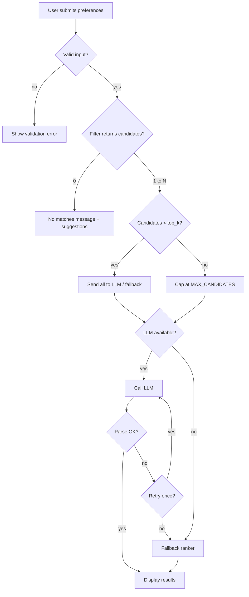

# Edge Cases & Exception Handling Guide

Comprehensive catalog of edge cases for the **AI-Powered Restaurant Recommendation System**, aligned with [`context.md`](context.md), [`architecture.md`](architecture.md), and [`implementation-plan.md`](implementation-plan.md).

Use this document during implementation and testing. Each entry defines **scenario → expected behavior → handler**.

---

## How to Read This Document

| Column | Meaning |
|--------|---------|
| **ID** | Unique reference (e.g., `DATA-01`) |
| **Severity** | `Critical` — must handle before ship; `High` — user-facing failure; `Medium` — degraded UX; `Low` — nice-to-have |
| **Module** | Primary code owner per `architecture.md` |
| **Behavior** | What the system should do |
| **Test** | Suggested verification |

### Severity Legend

- **Critical** — Data corruption, security risk, crash, or silent wrong recommendations
- **High** — Broken flow; user sees error but app stays up
- **Medium** — Partial feature loss; fallback or message acceptable
- **Low** — Cosmetic or rare; log and continue

---

## Quick Reference: Decision Matrix



---

## 1. Data Ingestion & Preprocessing

| ID | Scenario | Severity | Module | Expected behavior | Test |
|----|----------|----------|--------|-------------------|------|
| DATA-01 | Hugging Face download fails (network, 503) | Critical | `data/loader.py` | Retry 3× with exponential backoff; if cache exists, use stale cache with warning log; else raise `DataLoadError` with setup instructions | Mock connection error |
| DATA-02 | Cache file missing on startup | High | `data/loader.py` | Trigger ingest automatically or show “Run ingest first” with CLI command | Delete parquet, start app |
| DATA-03 | Cache file corrupted / unreadable | Critical | `data/repository.py` | Delete corrupt file, re-ingest; log error | Truncate parquet file |
| DATA-04 | Dataset schema changed (new/renamed columns) | High | `data/preprocessor.py` | Map known aliases; log unmapped columns; fail ingest if required fields missing | Fixture with wrong columns |
| DATA-05 | Required field entirely missing in raw data | Critical | `preprocessor.py` | Skip row if `name` or `city` null; log skip count | Inject null names |
| DATA-06 | `rating` is null, `"-"`, or non-numeric | High | `preprocessor.py` | Coerce to `null`; exclude from rating filter or treat as 0 | Rows with `"New"`, `"-"` |
| DATA-07 | `rating` out of range (<0 or >5) | Medium | `preprocessor.py` | Clamp to [0, 5] or set null | rating = 9.2 |
| DATA-08 | `cost_for_two` null or unparsable (`"₹1,200 for two"`) | High | `preprocessor.py` | Strip symbols, parse int; null → exclude from budget filter only | Mixed cost formats |
| DATA-09 | `cost_for_two` is 0 or negative | Medium | `preprocessor.py` | Set null; do not assign budget tier | cost = 0 |
| DATA-10 | Duplicate restaurant rows | Medium | `preprocessor.py` | Dedupe by `(name, city, location_detail)` keep highest rating | Duplicate fixture |
| DATA-11 | City name variants (`"Bengaluru"`, `"Bangalore"`, `"bangalore "`) | High | `preprocessor.py` | Maintain `CITY_ALIASES` map to canonical city | Alias lookup table |
| DATA-12 | Cuisine string empty or `" "` | Medium | `preprocessor.py` | Set `cuisines = []`; cuisine filter skipped if user didn't specify | Empty cuisine |
| DATA-13 | Cuisine with extra delimiters (`"Cafe, Italian, "` ) | Low | `preprocessor.py` | Split on `,`, strip whitespace, drop empty tokens | Messy cuisine string |
| DATA-14 | Very long restaurant name (>500 chars) | Low | `preprocessor.py` | Truncate for display; keep full in `raw_metadata` | Long string row |
| DATA-15 | Dataset smaller than expected (<1000 rows) | High | `loader.py` | Warn in logs; proceed but flag “degraded dataset” in health check | Mock small dataset |
| DATA-16 | Ingest interrupted mid-write | Critical | `loader.py` | Write to temp file `restaurants.parquet.tmp`, atomic rename on success | Kill during write |
| DATA-17 | Disk full during cache write | Critical | `loader.py` | Catch `OSError`; surface clear error; do not leave partial cache | Mock disk full |
| DATA-18 | All rows fail preprocessing | Critical | `loader.py` | Abort ingest; do not overwrite good cache | All-invalid fixture |

### DATA implementation notes

```python
# City alias example (extend as discovered during Phase 1)
CITY_ALIASES = {
    "bengaluru": "Bangalore",
    "bangalore": "Bangalore",
    "new delhi": "Delhi",
    "delhi ncr": "Delhi",
}
```

---

## 2. User Input & Validation

| ID | Scenario | Severity | Module | Expected behavior | Test |
|----|----------|----------|--------|-------------------|------|
| INPUT-01 | `location` empty or whitespace | High | `models/preferences.py`, UI | Pydantic validation error: “Location is required” | Submit empty |
| INPUT-02 | `location` not in dataset cities | High | `filter.py` / UI | Validate against `get_cities()`; suggest closest match or “Did you mean …?” | `"Mumbaii"` |
| INPUT-03 | `location` valid alias not in dropdown (user types) | Medium | `preprocessor` + UI | Normalize via `CITY_ALIASES` before filter | Type `"Bengaluru"` |
| INPUT-04 | `budget` not provided | High | Pydantic | Default to `medium` or reject — **pick one and document** | Missing field |
| INPUT-05 | `budget` invalid value (`"cheap"`) | High | Pydantic | Validation error with allowed enum | Invalid enum |
| INPUT-06 | `cuisine` empty / null | Medium | `filter.py` | Skip cuisine filter; broader results | cuisine=null |
| INPUT-07 | `cuisine` not in dataset (e.g., `"Mexican"` in city with none) | High | Filter + UI | After filter: empty set → “No {cuisine} in {location}” | Obscure cuisine |
| INPUT-08 | `cuisine` partial match (`"ital"`) | Medium | `filter.py` | Case-insensitive substring match on any cuisine token | Partial input |
| INPUT-09 | `min_rating` > 5 | High | Pydantic | Clamp to 5.0 or validation error | min_rating=6 |
| INPUT-10 | `min_rating` negative | High | Pydantic | Clamp to 0.0 | min_rating=-1 |
| INPUT-11 | `min_rating` filters out all restaurants in city | High | Service | Empty result path (FILTER-08) | min_rating=4.9 in sparse city |
| INPUT-12 | `additional_preferences` very long (>2000 chars) | High | `preferences.py` | Truncate to 500 chars with warning log | 10k char string |
| INPUT-13 | `additional_preferences` empty / whitespace only | Low | — | Treat as null; omit from prompt emphasis | `"   "` |
| INPUT-14 | Prompt injection in `additional_preferences` | Critical | `ai/prompt.py` | Sanitize; system prompt ignores override instructions; never execute user text as code | `"Ignore previous instructions..."` |
| INPUT-15 | Special characters / emoji in preferences | Medium | All layers | UTF-8 safe; no crash; pass through to LLM | `"family-friendly 👨‍👩‍👧"` |
| INPUT-16 | SQL/HTML in input | Medium | UI | Escape on render; never interpolate into raw SQL (N/A if pandas only) | `"<script>..."` |
| INPUT-17 | User submits form twice rapidly (double-click) | Medium | UI | Disable button during request; debounce | Double submit |
| INPUT-18 | `top_k` requested > candidate count | Medium | Service | Return all candidates ranked; no padding with fake entries | top_k=10, 3 candidates |

---

## 3. Filtering & Domain Logic

| ID | Scenario | Severity | Module | Expected behavior | Test |
|----|----------|----------|--------|-------------------|------|
| FILTER-01 | Zero restaurants match all filters | High | `domain/filter.py` | Raise `EmptyFilterResultError`; UI: “No restaurants match. Try: lower min rating, different cuisine, or broader budget.” | Impossible combo |
| FILTER-02 | Only 1 restaurant matches | Medium | Service | Send 1 to LLM; return 1 card; no error | Restrictive filters |
| FILTER-03 | Matches > `MAX_CANDIDATES` (e.g., 500) | High | `filter.py` | Sort by rating desc; take top `MAX_CANDIDATES` (default 30) | Popular city + loose filters |
| FILTER-04 | Many ties on same rating | Low | `filter.py` | Secondary sort by `votes` desc, then `name` asc | Equal ratings |
| FILTER-05 | Budget filter excludes all (cost null for every match) | High | `filter.py` | If all costs null, skip budget filter with warning log; else empty result | City with null costs |
| FILTER-06 | User budget `low` but only `high` tier restaurants in cuisine | High | UI message | Empty result with hint to raise budget | low + niche cuisine |
| FILTER-07 | Cuisine filter too strict (exact match only) | Medium | `filter.py` | Use token/substring match, not exact equality | `"North Indian"` vs `"Indian"` |
| FILTER-08 | Location case mismatch (`"delhi"` vs `"Delhi"`) | High | `filter.py` | Case-insensitive compare on canonical city | Lowercase input |
| FILTER-09 | Combined filters: location valid, cuisine invalid for city | High | Service | Empty set with specific message naming failing filter | Bangalore + rare cuisine |
| FILTER-10 | `min_rating` excludes restaurants with null rating | Medium | `filter.py` | Treat null rating as below threshold (excluded) | null rating rows |
| FILTER-11 | Percentile-based budget tiers skewed by outliers | Medium | `domain/budget.py` | Use percentile clipping (1st–99th) before tier assignment | Ingest stats test |
| FILTER-12 | Single-city dataset accidentally loaded | High | Repository | `get_cities()` returns 1; warn in UI banner | Corrupt subset |
| FILTER-13 | Filter returns candidates but all lack `cost_for_two` | Medium | Output | Display “Cost not available” in UI | Null cost field |
| FILTER-14 | Stale cache (dataset updated on HF) | Low | Ops | Document `ingest --force`; optional cache TTL in config | Manual re-ingest |

### Empty-result user message template

```
No restaurants found in {location} matching:
  • Cuisine: {cuisine or "any"}
  • Budget: {budget}
  • Minimum rating: {min_rating}

Suggestions:
  • Lower minimum rating
  • Try a different cuisine or leave cuisine blank
  • Switch to a broader budget tier
```

---

## 4. LLM & Recommendation Engine

| ID | Scenario | Severity | Module | Expected behavior | Test |
|----|----------|----------|--------|-------------------|------|
| LLM-01 | `LLM_API_KEY` missing or empty | High | `config.py`, UI | Skip LLM; use fallback ranker; show info banner “Using rule-based rankings (no API key)” | Unset env |
| LLM-02 | Invalid / revoked API key | High | `ai/client.py` | Catch 401; message “Check API key”; fallback | Mock 401 |
| LLM-03 | Rate limit (429) | High | `client.py` | Retry once after backoff; then fallback | Mock 429 |
| LLM-04 | Request timeout | High | `client.py` | Retry once (30s); then fallback | Mock timeout |
| LLM-05 | Model not found / wrong `LLM_MODEL` | High | `client.py` | Clear error in logs; fallback | Invalid model name |
| LLM-06 | Provider outage (5xx) | High | `client.py` | Retry once; fallback | Mock 503 |
| LLM-07 | Response truncated (token limit) | High | `parser.py` | Detect incomplete JSON; retry with fewer candidates or fallback | Max tokens exceeded |
| LLM-08 | LLM returns invalid JSON | High | `parser.py` | One re-prompt: “Return valid JSON only”; else fallback | Malformed response |
| LLM-09 | LLM returns JSON with extra markdown fences | Medium | `parser.py` | Strip ` ```json ` wrappers before parse | Fenced response |
| LLM-10 | LLM returns fewer than `top_k` items | Medium | Service | Display what was returned; no padding | top_k=5, got 3 |
| LLM-11 | LLM returns more than `top_k` items | Medium | `parser.py` | Take first `top_k` by rank field | 10 items returned |
| LLM-12 | LLM hallucinates restaurant not in candidate list | Critical | `parser.py` | Reject unknown `restaurant_id`; drop entry; log warning; if <3 valid, fallback | Fake ID in response |
| LLM-13 | LLM duplicates same `restaurant_id` | Medium | `parser.py` | Dedupe; keep best rank | Duplicate IDs |
| LLM-14 | LLM swaps ranks (gaps, duplicates) | Low | `parser.py` | Re-number ranks 1..N after validation | rank 1,1,4 |
| LLM-15 | Empty `explanation` for a recommendation | Medium | `parser.py` | Use template: “Matches your preferences for {location} and {budget} budget.” | Blank explanation |
| LLM-16 | `summary` field missing | Low | Service | Omit summary section in UI | Null summary |
| LLM-17 | LLM refuses (“I cannot help”) | High | Service | Fallback immediately | Refusal response |
| LLM-18 | Ollama not running (local provider) | High | `client.py` | Connection error → fallback + “Start Ollama” hint | Ollama down |
| LLM-19 | Prompt exceeds context window | High | `prompt.py` | Reduce `MAX_CANDIDATES`; truncate candidate fields to essentials | 100 candidates |
| LLM-20 | Temperature too high → inconsistent rankings | Low | `config.py` | Default temperature 0.2–0.4 for stability | Config test |
| LLM-21 | Concurrent requests (Streamlit rerun) | Medium | Service | Stateless service; no shared mutable state | Parallel clicks |
| LLM-22 | LLM recommends against budget in explanation only | Medium | Prompt | System prompt: respect budget tier in ranking | Manual review |
| LLM-23 | Non-English `additional_preferences` | Low | LLM | Pass through; LLM handles multilingual | Hindi preferences |
| LLM-24 | Cost in LLM output disagrees with dataset | Medium | Output formatter | **Always prefer dataset** for rating/cost/name; LLM only for explanation/rank | Mismatched cost |

### Fallback ranker rules (`ai/fallback.py`)

| Condition | Action |
|-----------|--------|
| Any LLM failure after retry | Sort candidates by `rating` desc, `votes` desc |
| Explanation | Template: “Highly rated {cuisine} option in {city} within your {budget} budget.” |
| `summary` | Template: “Top picks in {city} based on rating and your filters.” |
| Candidates < `top_k` | Return all available |

---

## 5. Response Parsing & Output Assembly

| ID | Scenario | Severity | Module | Expected behavior | Test |
|----|----------|----------|--------|-------------------|------|
| PARSE-01 | `restaurant_id` valid but row removed since filter | Low | `parser.py` | Join from candidate list in memory, not re-query | N/A |
| PARSE-02 | LLM returns string rating (`"4.5"`) | Medium | `parser.py` | Coerce to float; on failure use dataset rating | String rating |
| PARSE-03 | Missing `name` in LLM output | Medium | `parser.py` | Backfill from dataset by `restaurant_id` | Partial JSON |
| PARSE-04 | `estimated_cost` format inconsistent | Low | UI | Format from dataset `cost_for_two`; ignore LLM cost if present | Display test |
| PARSE-05 | All parsed recommendations filtered out (hallucinations) | Critical | Service | Trigger full fallback | All invalid IDs |
| PARSE-06 | Partial valid recommendations (2 of 5 valid) | High | Service | Show 2; optionally run fallback for remaining slots | Mixed validity |

---

## 6. Application Orchestration & Service Layer

| ID | Scenario | Severity | Module | Expected behavior | Test |
|----|----------|----------|--------|-------------------|------|
| SVC-01 | Repository not initialized before first request | Critical | `services/recommendation.py` | Lazy-load on first call; block UI until ready with spinner | Cold start |
| SVC-02 | Exception anywhere in pipeline | High | Service | Catch, log stack trace, return `ErrorResponse` with safe user message (no stack in UI) | Force exception |
| SVC-03 | `top_k=0` or negative | Medium | Service | Default to `TOP_K_RESULTS` from config (5) | Invalid top_k |
| SVC-04 | `top_k` very large (100) | Medium | Service | Cap at `len(candidates)` and config max (e.g., 10) | top_k=100 |
| SVC-05 | Request takes >60s | Medium | UI | Show timeout message; offer retry | Slow LLM mock |
| SVC-06 | Memory pressure loading 51K rows | Medium | Repository | Use Parquet + categorical dtypes; avoid duplicate copies | Memory profiling |
| SVC-07 | Streamlit session reload mid-request | Medium | UI | Idempotent; user re-clicks; no partial state | Browser refresh |

---

## 7. UI & Presentation

| ID | Scenario | Severity | Module | Expected behavior | Test |
|----|----------|----------|--------|-------------------|------|
| UI-01 | Data still loading on first page load | High | `ui/app.py` | Full-page spinner: “Loading restaurant data…” | First launch |
| UI-02 | Ingest never run | High | UI | Actionable error + link to README ingest command | No parquet |
| UI-03 | No API key in Streamlit Cloud secrets | High | UI | Banner + fallback mode label on results | Deploy without secret |
| UI-04 | Empty recommendations list after success | High | UI | “Something went wrong” + retry; log for dev | Empty response bug |
| UI-05 | Very long explanation text | Low | UI | Collapse with “Read more” expander | Long explanation |
| UI-06 | Rating display: null | Medium | UI | Show “Not rated” or “—” | Null rating |
| UI-07 | Mobile/narrow viewport | Low | UI | Cards stack vertically (Streamlit default) | Responsive check |
| UI-08 | User changes preferences without re-running | Low | UI | Stale results until button clicked again | UX note |
| UI-09 | Unicode in restaurant names | Medium | UI | Render correctly | Non-ASCII names |
| UI-10 | Streamlit widget state reset on deploy | Low | Ops | Document expected behavior | Redeploy |

---

## 8. Configuration & Environment

| ID | Scenario | Severity | Module | Expected behavior | Test |
|----|----------|----------|--------|-------------------|------|
| ENV-01 | `.env` file missing | Medium | `config.py` | Use defaults + env vars; LLM key optional | No .env |
| ENV-02 | Invalid `MAX_CANDIDATES` (negative, string) | Medium | `config.py` | Pydantic validation; default 30 | Bad env value |
| ENV-03 | `DATA_CACHE_PATH` points to non-writable dir | High | `loader.py` | Fail ingest with permission error | Read-only path |
| ENV-04 | Wrong `LLM_PROVIDER` value | Medium | `config.py` | Validation error at startup | `LLM_PROVIDER=foo` |
| ENV-05 | Config changed but Streamlit cache stale | Medium | UI | Document restart required; `@st.cache_resource` clear | Change .env |

---

## 9. Security & Abuse

| ID | Scenario | Severity | Module | Expected behavior | Test |
|----|----------|----------|--------|-------------------|------|
| SEC-01 | API key in logs | Critical | All | Never log `LLM_API_KEY`; redact in error messages | Log inspection |
| SEC-02 | API key committed to git | Critical | Ops | `.gitignore` `.env`; pre-commit reminder in README | Grep repo |
| SEC-03 | Prompt injection via `additional_preferences` | Critical | `prompt.py` | System guardrails; length cap; no tool execution | Injection strings |
| SEC-04 | PII in logs (user preferences) | Medium | Service | Log at INFO without full free-text in production | Log policy |
| SEC-05 | Unbounded LLM spend (spam requests) | Medium | UI/ops | Rate limit per session (optional); cap candidates | Rapid requests |

---

## 10. Deployment & Operations

| ID | Scenario | Severity | Module | Expected behavior | Test |
|----|----------|----------|--------|-------------------|------|
| OPS-01 | Streamlit Cloud cold start + HF download | High | Deploy | Ship pre-built `restaurants.parquet` or document long first load | Cold deploy |
| OPS-02 | Parquet too large for git (>100MB) | Medium | Deploy | Use Git LFS, S3, or ingest-on-start with progress bar | Size check |
| OPS-03 | Hugging Face rate limit on shared IP | Medium | `loader.py` | Cache aggressively; retry with backoff | Rate limit mock |
| OPS-04 | Python version mismatch (<3.11) | Medium | README | Document `requires-python >=3.11` | Version check |
| OPS-05 | Missing dependency at runtime | High | Deploy | Pinned `requirements.txt` | Fresh venv install |
| OPS-06 | Health check endpoint (optional FastAPI) | Low | API | `GET /health` → dataset loaded, row count | Health probe |

---

## 11. Edge Case → Exception Type Mapping

Define typed exceptions for clean handling:

| Exception | When raised | HTTP code (if API) |
|-----------|-------------|-------------------|
| `DataLoadError` | HF download / cache failure | 503 |
| `DataValidationError` | Ingest produces 0 valid rows | 500 |
| `EmptyFilterResultError` | Zero candidates after filter | 404 |
| `LLMProviderError` | API errors after retry | 502 |
| `LLMParseError` | JSON invalid after repair | 502 (internal; user sees fallback) |
| `ConfigurationError` | Missing required config for chosen mode | 500 |

```python
# src/domain/exceptions.py (recommended)
class EmptyFilterResultError(Exception):
    def __init__(self, preferences, suggestions: list[str]):
        self.preferences = preferences
        self.suggestions = suggestions
```

---

## 12. Test Matrix (Minimum)

Map critical/high edge cases to automated tests:

| Test file | IDs to cover |
|-----------|--------------|
| `tests/test_data.py` | DATA-05, 06, 08, 10, 11, 16 |
| `tests/test_filter.py` | FILTER-01, 03, 05, 07, 08, 10 |
| `tests/test_parser.py` | PARSE-02, 05, 06; LLM-08, 09, 12, 13 |
| `tests/test_prompt.py` | INPUT-14; LLM-19 |
| `tests/test_service.py` | SVC-01, 02; FILTER-01; LLM-01, 04, 08 |
| `tests/test_preferences.py` | INPUT-01, 05, 09, 10, 12 |

### Manual QA checklist (pre-demo)

- [ ] Valid request → 5 cards with explanations
- [ ] Impossible filters → helpful empty message
- [ ] No API key → fallback with banner
- [ ] Airplane mode during ingest → cache or clear error
- [ ] Prompt injection string → normal recommendations, no leakage
- [ ] City alias (`Bengaluru`) → same results as `Bangalore`
- [ ] Single match → 1 card, no crash
- [ ] Double-click submit → single request

---

## 13. Implementation Priority

### Must-have before MVP (Phase 6)

`DATA-01`, `DATA-02`, `DATA-05`, `DATA-06`, `DATA-08`, `DATA-11`, `INPUT-01`, `INPUT-02`, `INPUT-14`, `FILTER-01`, `FILTER-03`, `FILTER-08`, `LLM-01`, `LLM-04`, `LLM-08`, `LLM-12`, `LLM-24`, `PARSE-05`, `SVC-02`, `UI-01`, `UI-02`, `UI-03`, `SEC-01`, `SEC-03`

### Should-have

Remaining **High** severity items

### Nice-to-have

**Low** severity + Phase 7 extensions

---

## 14. Logging & Observability per Edge Case

| Event | Log level | Fields |
|-------|-----------|--------|
| Empty filter | INFO | location, cuisine, budget, min_rating, candidate_count=0 |
| Candidate cap applied | DEBUG | before_count, after_count, MAX_CANDIDATES |
| LLM retry | WARN | attempt, error_type |
| Fallback used | WARN | reason, candidate_count |
| Hallucinated ID dropped | WARN | restaurant_id |
| Ingest skip row | DEBUG | reason, row_index |
| Parse failure | ERROR | raw_response_truncated |

---

## Related Documents

| Document | Purpose |
|----------|---------|
| [`architecture.md`](architecture.md) §7.5 | Error handling & fallback design |
| [`implementation-plan.md`](implementation-plan.md) | Phase 6 testing tasks |
| [`context.md`](context.md) | Required output fields |

---

## Changelog

| Date | Change |
|------|--------|
| 2026-05-21 | Initial edge case catalog |
