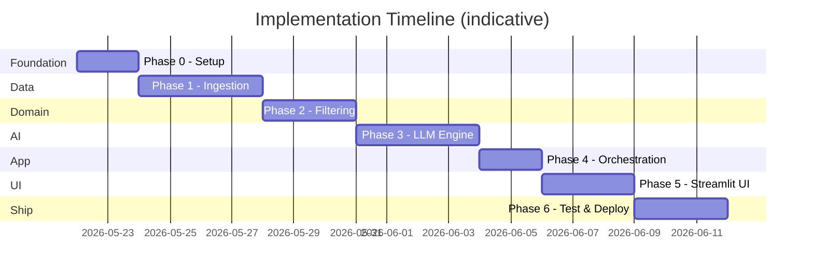
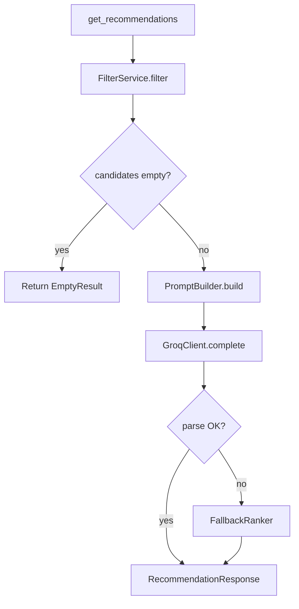

# Phase-Wise Implementation Plan

Implementation roadmap for the **AI-Powered Restaurant Recommendation System**, derived from [`context.md`](context.md) and [`architecture.md`](architecture.md).

---

## Overview

| Item | Detail |
|------|--------|
| **Total phases** | 7 (0–6) |
| **Estimated duration** | 3–4 weeks (solo developer, part-time) |
| **Primary stack** | Python 3.11+, Pandas, Streamlit, **Groq API**, Pydantic |
| **LLM provider** | **Groq** (not OpenAI) — used in Phase 3 engine and Phase 4 orchestration |
| **Delivery model** | Incremental — each phase produces a testable artifact |

### Phase Map (aligned to system workflow)

| Phase | Name | Maps to `context.md` workflow |
|-------|------|-------------------------------|
| 0 | Project foundation | — |
| 1 | Data ingestion & preprocessing | §1 Data Ingestion |
| 2 | Domain models & filtering | §3 Integration Layer |
| 3 | LLM recommendation engine | §4 Recommendation Engine |
| 4 | Application orchestration | End-to-end pipeline |
| 5 | UI & output display | §2 User Input + §5 Output Display |
| 6 | Testing, polish & deployment | Cross-cutting + checklist |



---

## Requirements Traceability

Maps [`context.md`](context.md) checklist items to phases:

| Requirement | Phase | Verification |
|-------------|-------|--------------|
| Load Zomato dataset from Hugging Face | 1 | CLI/script loads ≥50K rows |
| Preprocess and extract required fields | 1 | Parquet cache + canonical schema |
| UI for user preference input | 5 | Streamlit form with validation |
| Filter before LLM call | 2 | Unit tests; candidate cap enforced |
| LLM ranking + explanation prompt | 3 | JSON output with explanations |
| Display name, cuisine, rating, cost, explanation | 5 | UI cards show all five fields |

---

## Phase 0: Project Foundation

**Goal:** Runnable repo skeleton, dependencies, and configuration — no business logic yet.

**Duration:** 1–2 days

### Tasks

| # | Task | File(s) / artifact |
|---|------|-------------------|
| 0.1 | Initialize Python project structure per `architecture.md` §10 | `src/`, `tests/`, `data/` |
| 0.2 | Create `requirements.txt` | `datasets`, `pandas`, `streamlit`, `pydantic`, `pydantic-settings`, `openai` (Groq-compatible SDK), `python-dotenv`, `pytest` |
| 0.3 | Add `.gitignore` | Ignore `data/`, `.env`, `__pycache__/`, `.venv/` |
| 0.4 | Create `.env.example` | `LLM_PROVIDER=groq`, `LLM_API_KEY` (Groq key), `LLM_MODEL`, `DATA_CACHE_PATH`, `MAX_CANDIDATES`, `TOP_K_RESULTS` |
| 0.5 | Implement `src/config.py` | `Settings` via `pydantic-settings` |
| 0.6 | Scaffold Pydantic models (empty/stub) | `src/models/preferences.py`, `restaurant.py`, `recommendation.py` |
| 0.7 | Write `README.md` | Setup, env vars, how to run (placeholder) |

### Deliverables

- [ ] `pip install -r requirements.txt` succeeds
- [ ] `src/config.py` loads settings from `.env`
- [ ] Directory layout matches architecture §10

### Acceptance criteria

```bash
python -c "from src.config import Settings; print(Settings())"
```

### Dependencies

- None (first phase)

---

## Phase 1: Data Ingestion & Preprocessing

**Goal:** Download Hugging Face dataset, normalize to canonical schema, cache locally.

**Duration:** 3–4 days

**Maps to:** `context.md` → Data Ingestion | `architecture.md` → §3.1, §4

### Tasks

| # | Task | File(s) |
|---|------|---------|
| 1.1 | Implement HF dataset loader | `src/data/loader.py` |
| 1.2 | Inspect raw schema; document column mapping | `doc/data-schema.md` (optional) |
| 1.3 | Build preprocessor: null handling, city normalization, cuisine tokenization | `src/data/preprocessor.py` |
| 1.4 | Assign `budget_tier` from cost percentiles (33/66) or fixed INR bands | `src/domain/budget.py` (basic version) |
| 1.5 | Write Parquet cache to `data/restaurants.parquet` | `src/data/loader.py` |
| 1.6 | Implement `RestaurantRepository` — load cache, expose DataFrame | `src/data/repository.py` |
| 1.7 | Add CLI entry: `python -m src.data.loader --ingest` | `src/data/loader.py` |
| 1.8 | Log stats: row count, null %, unique cities/cuisines | ingestion logs |

### Canonical fields (must populate)

- `id`, `name`, `city`, `cuisines[]`, `rating`, `cost_for_two`, `budget_tier`

### Deliverables

- [ ] `data/restaurants.parquet` generated (gitignored)
- [ ] `Restaurant` Pydantic model fully defined
- [ ] Repository returns DataFrame in <5s on reload

### Acceptance criteria

| Check | Expected |
|-------|----------|
| Row count | ~51,000+ restaurants |
| Required fields | <5% null on name, city, rating |
| Cache hit | Second run skips HF download |
| Cities list | `repository.get_cities()` returns non-empty list |

### Unit tests (`tests/test_data.py`)

- Preprocessor handles missing cost/rating
- Cuisine string `"North Indian, Chinese"` → `["North Indian", "Chinese"]`
- Budget tier assignment is deterministic

### Dependencies

- Phase 0 complete
- Network access for first Hugging Face download

### Risks & mitigations

| Risk | Mitigation |
|------|------------|
| Raw column names differ from docs | Inspect first batch; map dynamically in preprocessor |
| 574 MB download slow | Document one-time ingest; commit sample Parquet for CI only |

---

## Phase 2: Domain Layer — Filtering & Preparation

**Goal:** Deterministic filter pipeline that returns a bounded candidate set for the LLM.

**Duration:** 2–3 days

**Maps to:** `context.md` → Integration Layer | `architecture.md` → §3.3, §5 Domain

### Tasks

| # | Task | File(s) |
|---|------|---------|
| 2.1 | Finalize `UserPreferences` model with validation | `src/models/preferences.py` |
| 2.2 | Implement `FilterService.filter(preferences) -> list[Restaurant]` | `src/domain/filter.py` |
| 2.3 | Location filter (case-insensitive city match) | `filter.py` |
| 2.4 | Cuisine filter (substring/token match) | `filter.py` |
| 2.5 | Rating filter (`rating >= min_rating`) | `filter.py` |
| 2.6 | Budget filter via `BudgetMapper` | `src/domain/budget.py` |
| 2.7 | Sort by rating desc; **dedupe by restaurant name**; cap at `MAX_CANDIDATES` (default 30) | `filter.py`, `src/domain/dedupe.py` |
| 2.8 | Serialize candidates to compact dicts for prompt | `filter.py` or `src/domain/serialize.py` |
| 2.9 | Handle empty results with clear error type | `src/domain/exceptions.py` |

### Filter pipeline order

```
location → cuisine → rating → budget → sort → **dedupe by name** → cap → serialize
```

### Deliverables

- [ ] `FilterService` with configurable cap
- [ ] `EmptyFilterResultError` when zero matches
- [ ] Metadata helpers: `get_cities()`, `get_cuisines()` on repository

### Acceptance criteria

| Input | Expected |
|-------|----------|
| Bangalore + medium + Italian + min 4.0 | Non-empty list, all city=Bangalore, rating≥4.0 |
| Invalid city | Empty or validation error before filter |
| Restrictive filters | Empty set → exception with helpful message |
| Candidate count | Never exceeds `MAX_CANDIDATES` |
| **Unique names** | No two candidates share the same restaurant name (case-insensitive) |

### Unit tests (`tests/test_filter.py`)

- Each filter in isolation
- Combined filters
- Cap enforced
- Case-insensitive location

### Dependencies

- Phase 1 (repository + canonical schema)

---

## Phase 3: LLM Recommendation Engine

**Goal:** Prompt builder, LLM client, JSON parser, and fallback ranker.

**Duration:** 3–4 days

**Maps to:** `context.md` → Recommendation Engine | `architecture.md` → §3.4, §7

### Tasks

| # | Task | File(s) |
|---|------|---------|
| 3.1 | Define `RecommendationResponse` model | `src/models/recommendation.py` |
| 3.2 | Implement `PromptBuilder.build(preferences, candidates)` | `src/ai/prompt.py` |
| 3.3 | System prompt: role, JSON schema, “only from list” constraint | `prompt.py` |
| 3.4 | User prompt: preferences + candidate JSON + top-K instruction | `prompt.py` |
| 3.5 | Implement `LLMClient` protocol + **`GroqClient`** (primary) | `src/ai/client.py` |
| 3.6 | Optional: `OllamaClient` for local dev without API key | `client.py` |
| 3.5b | Groq uses OpenAI SDK with `base_url=https://api.groq.com/openai/v1` | `client.py` |
| 3.7 | Implement `ResponseParser` — validate JSON, join by `restaurant_id`, **dedupe by name** | `src/ai/parser.py`, `src/domain/dedupe.py` |
| 3.7b | System prompt rule: each restaurant name at most once | `src/ai/prompt.py` |
| 3.8 | Implement `FallbackRanker` — rating sort, **dedupe by name**, template explanation | `src/ai/fallback.py` |
| 3.9 | Retry once on timeout; JSON repair re-prompt | `client.py` / `parser.py` |
| 3.10 | Standalone script to test prompt + mock response | `scripts/test_llm.py` |

### Prompt contract (LLM must return)

```json
{
  "summary": "optional string",
  "recommendations": [
    {
      "rank": 1,
      "restaurant_id": "...",
      "name": "...",
      "cuisine": "...",
      "rating": 4.5,
      "estimated_cost": "...",
      "explanation": "..."
    }
  ]
}
```

### Deliverables

- [ ] End-to-end LLM call with real API key returns valid `RecommendationResponse`
- [ ] Fallback works when `LLM_API_KEY` unset or API fails
- [ ] No hallucinated IDs (all `restaurant_id` in candidate set)

### Acceptance criteria

| Check | Expected |
|-------|----------|
| JSON parse success rate | ≥90% on 5 manual test runs |
| Explanations | Non-empty, reference user preferences |
| Summary | Present when prompt requests it |
| Fallback | Returns top-K with template text |
| **Unique names** | No duplicate `name` in recommendations (parser + fallback) |
| Latency | <30s for ≤30 candidates (model-dependent) |

### Unit tests (`tests/test_prompt.py`, `tests/test_parser.py`)

- Prompt contains all preference fields
- Parser handles valid/invalid JSON
- Parser rejects IDs not in candidate list
- Fallback ordering matches rating desc

### Dependencies

- Phase 2 (candidate serialization format)
- Groq API key ([console.groq.com](https://console.groq.com/keys)) or Ollama for local dev

### Groq configuration (reference)

```env
LLM_PROVIDER=groq
LLM_API_KEY=gsk_...          # Groq API key
LLM_MODEL=llama-3.3-70b-versatile
```

---

## Phase 4: Application Orchestration

**Goal:** Single service that wires data → filter → **Groq LLM** → response.

**Duration:** 1–2 days

**Maps to:** `architecture.md` → §5 Application Layer, §6.1, §8.1

> **LLM provider:** Phase 4 uses **Groq**, not OpenAI. Ensure `GroqClient` is the default in `get_llm_client()` and `LLM_PROVIDER=groq` in `.env`.

### Tasks

| # | Task | File(s) |
|---|------|---------|
| 4.0 | Add **`GroqClient`**; set `groq` as default `LLM_PROVIDER` | `src/ai/client.py`, `src/config.py`, `.env.example` |
| 4.1 | Implement `RecommendationService.get_recommendations()` | `src/services/recommendation.py` |
| 4.2 | Startup: load repository (cache) once via `@st.cache_resource` or singleton | `recommendation.py` |
| 4.3 | Wire FilterService → PromptBuilder → **GroqClient** → Parser | `recommendation.py` |
| 4.4 | On empty filter: return structured error, not LLM call | `recommendation.py` |
| 4.5 | On Groq API failure: invoke FallbackRanker | `recommendation.py` |
| 4.6 | Add basic logging (filter count, Groq latency, fallback used) | `recommendation.py` |
| 4.6b | Final dedupe by name in `_enrich_response` (safety net after LLM) | `recommendation.py`, `dedupe.py` |
| 4.7 | CLI smoke test: `python -m src.main --location Bangalore ...` | `src/main.py` |

### Service flow



### Deliverables

- [ ] `RecommendationService` callable from CLI and (later) UI
- [ ] Structured logging on each request

### Acceptance criteria

```bash
python -m src.main --location Bangalore --budget medium --cuisine Italian --top-k 5
# Prints 5 recommendations with explanations
```

### Integration test (`tests/test_service.py`)

- Mock LLM returns fixed JSON → service returns expected structure
- Empty filter → no LLM call (mock assert not called)

### Dependencies

- Phases 1, 2, 3
- **Groq API key** in `.env` (`LLM_API_KEY`)

### Environment (Phase 4)

| Variable | Value |
|----------|-------|
| `LLM_PROVIDER` | `groq` |
| `LLM_API_KEY` | Groq API key from [console.groq.com](https://console.groq.com/keys) |
| `LLM_MODEL` | `llama-3.3-70b-versatile` (or `llama-3.1-8b-instant` for faster/cheaper) |

### Acceptance criteria (Groq)

| Check | Expected |
|-------|----------|
| Provider | `get_llm_client()` returns `GroqClient` when `LLM_PROVIDER=groq` |
| API call | Recommendations returned via Groq within timeout |
| Missing key | Falls back to rule-based ranker with log warning |

---

## Phase 5: UI & Output Display

**Goal:** Streamlit app for preference input and recommendation display.

**Duration:** 2–3 days

**Maps to:** `context.md` → User Input + Output Display | `architecture.md` → §3.2, §3.5

### Tasks

| # | Task | File(s) |
|---|------|---------|
| 5.1 | Build Streamlit layout: sidebar preferences, main results | `src/ui/app.py` |
| 5.2 | Location dropdown from `repository.get_cities()` | `app.py` |
| 5.3 | Budget radio: low / medium / high | `app.py` |
| 5.4 | Cuisine dropdown or text input (from metadata) | `app.py` |
| 5.5 | Min rating slider (0–5) | `app.py` |
| 5.6 | Additional preferences text area | `app.py` |
| 5.7 | “Get Recommendations” button → `RecommendationService` | `app.py` |
| 5.8 | Loading spinner during LLM call | `app.py` |
| 5.9 | Result cards: **name**, **address**, cuisine, rating, cost, explanation, rank badge | `app.py` |
| 5.9b | Fix card contrast: explicit CSS colors (dark text on light card); no `<h3>` theme bleed | `app.py` |
| 5.9c | Enrich `Recommendation.address` from dataset in parser + fallback | `display.py`, `parser.py`, `fallback.py` |
| 5.9d | **No duplicate restaurant names** in result cards (dedupe in filter → parser → service) | `dedupe.py`, `filter.py`, `parser.py`, `recommendation.py` |
| 5.10 | Display optional `summary` from LLM at top | `app.py` |
| 5.11 | Error states: no matches, missing Groq API key, LLM failure message | `app.py` |
| 5.12 | Cache data load with `@st.cache_resource` | `app.py` |
| 5.13 | Entry point: `streamlit run src/ui/app.py` | `README.md` update |

### UI wireframe (logical)

```
┌─────────────────────────────────────────────────────────────┐
│  🍽️ Zomato AI Restaurant Recommender                        │
├──────────────────┬──────────────────────────────────────────┤
│  Preferences     │  Results                                  │
│  ─────────────   │  ───────                                  │
│  Location ▼      │  [Summary paragraph from LLM]             │
│  Budget ○○○      │                                           │
│  Cuisine ▼       │  ┌─────────────────────────────────────┐  │
│  Min rating ──●  │  │ #1 Restaurant Name (dark, visible)  │  │
│  Notes [____]    │  │ 📍 Full address line                │  │
│  [Recommend]     │  │ Italian · ★ 4.5 · ₹800 · explanation  │  │
│                  │  └─────────────────────────────────────┘  │
│                  │  ... (cards #2–#5)                        │
└──────────────────┴──────────────────────────────────────────┘
```

### Deliverables

- [ ] Runnable Streamlit app
- [ ] All five output fields visible per `context.md`
- [ ] README “Quick Start” section

### Acceptance criteria

| User action | Expected |
|-------------|----------|
| Submit valid prefs | 5 cards with explanations within 60s |
| **No duplicate names** | Each card shows a distinct restaurant name (e.g. Flechazo appears once) |
| **Card readability** | **Restaurant name** and **full address** visible on every card (not blank/truncated) |
| **Contrast** | Dark text on light card background in both light and dark Streamlit themes |
| Submit impossible prefs | Friendly “no matches” message |
| Missing API key | Clear setup instructions (not stack trace) |
| Reload page | Data cache loads quickly (no re-download) |

### Dependencies

- Phase 4 (`RecommendationService`)

---

## Phase 6: Testing, Polish & Deployment

**Goal:** Production-ready demo — tests pass, docs complete, deployable.

**Duration:** 2–3 days

**Maps to:** `architecture.md` → §11, §12 | `context.md` checklist (all items checked)

### Tasks

| # | Task | Area |
|---|------|------|
| 6.1 | Complete unit test suite (data, filter, prompt, parser) | `tests/` |
| 6.2 | Add integration test with mocked LLM | `tests/test_service.py` |
| 6.3 | Input sanitization: max length on `additional_preferences` | `preferences.py` |
| 6.4 | Prompt injection guard in system prompt | `prompt.py` |
| 6.5 | Tune `MAX_CANDIDATES`, `TOP_K_RESULTS` defaults | `config.py` |
| 6.6 | Finalize README: architecture diagram link, env setup, demo screenshots | `README.md` |
| 6.7 | Optional: FastAPI wrapper (`POST /api/recommendations`) | `src/api/` |
| 6.8 | Optional: Deploy to Streamlit Community Cloud | Streamlit secrets |
| 6.9 | Pre-warm Parquet on deploy (or bundle sample cache) | deployment |
| 6.10 | Update `context.md` checklist to all checked | documentation |

### Test coverage targets

| Module | Minimum tests |
|--------|---------------|
| `preprocessor` | 3 |
| `filter` | 8 |
| `prompt` | 2 |
| `parser` | 4 |
| `service` | 2 integration |

### Deployment checklist (Streamlit Cloud)

- [ ] `requirements.txt` pinned versions
- [ ] Secrets: `LLM_API_KEY` (Groq), `LLM_MODEL`, `LLM_PROVIDER=groq`
- [ ] `data/restaurants.parquet` pre-built or ingest on first run documented
- [ ] App URL shared in README

### Final acceptance (project complete)

All items from `context.md` requirements checklist:

- [x] Load Zomato dataset from Hugging Face
- [x] Preprocess and extract required fields
- [x] UI for user preference input
- [x] Filter restaurants before LLM call
- [x] LLM integration with ranking/explanation prompt
- [x] Display: name, cuisine, rating, cost, AI explanation

### Dependencies

- Phases 0–5 complete

---

## Optional Phase 7: Extensions (Post-MVP)

Not required for initial delivery. Hooks defined in `architecture.md` §13.

| Extension | Effort | Priority |
|-----------|--------|----------|
| FastAPI REST layer | 2 days | Medium |
| Ollama local dev mode (non-Groq) | 1 day | Low |
| Semantic cuisine search (embeddings) | 3–5 days | Low |
| User feedback thumbs up/down | 2 days | Low |
| Recommendation history (SQLite) | 3 days | Low |

---

## Milestone Summary

| Milestone | Phase | Demo-able outcome |
|-----------|-------|-------------------|
| **M0: Repo ready** | 0 | Install + config loads |
| **M1: Data ready** | 1 | Parquet cache + 51K restaurants queryable |
| **M2: Smart filter** | 2 | CLI prints filtered candidates |
| **M3: AI rankings** | 3 | Script prints LLM recommendations |
| **M4: Full pipeline** | 4 | CLI end-to-end recommendations |
| **M5: User app** | 5 | Streamlit demo for stakeholders |
| **M6: Shipped** | 6 | Tests green + deployed URL |

---

## Daily Execution Guide (suggested order)

| Day | Focus |
|-----|-------|
| 1 | Phase 0 + start Phase 1 (loader) |
| 2–3 | Phase 1 (preprocess, cache, repository) |
| 4–5 | Phase 2 (filter + tests) |
| 6–8 | Phase 3 (prompt, client, parser, fallback) |
| 9 | Phase 4 (RecommendationService) |
| 10–12 | Phase 5 (Streamlit UI) |
| 13–15 | Phase 6 (tests, README, deploy) |

---

## Definition of Done (per phase)

A phase is **done** when:

1. All tasks for that phase are complete
2. Acceptance criteria pass
3. Listed unit/integration tests pass (`pytest`)
4. No secrets committed to git
5. README updated if user-facing behavior changed

---

## Related Documents

| Document | Role |
|----------|------|
| [`context.md`](context.md) | Product requirements & workflow |
| [`architecture.md`](architecture.md) | Technical design & component specs |
| [`doc/problemStatement.txt`](doc/problemStatement.txt) | Original assignment brief |
